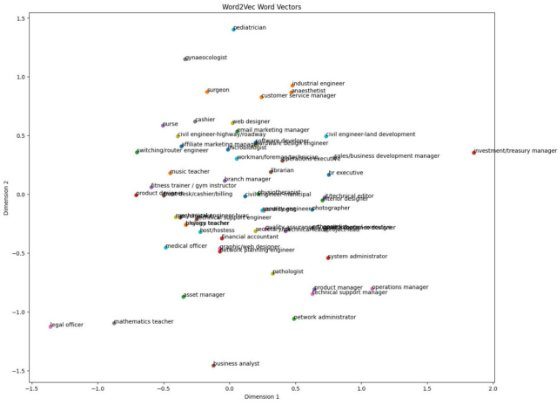
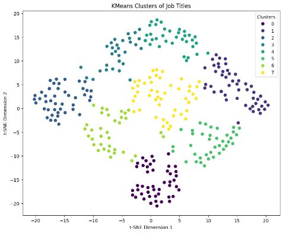
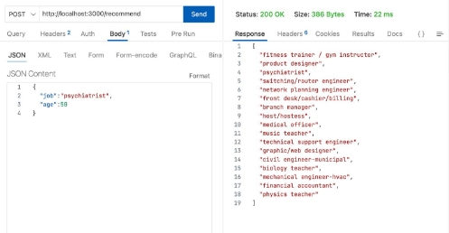

**Work participation, productivity, and mental and physical health outcomes among the elderly in India**

# **Abstract**

![ref1]

The primary objective of this study is to establish a model for forecasting human life expectancy and to delve into the connections between work participation, The effects of productivity, as well as the mental and physical health outcomes, on the elderly population in India. With the increasing number of ageing individuals, it is essential to understand the effects of work on their overall well-being. By leveraging data from the Longitudinal Aging Study in India (LASI), this research scrutinizes the links between work status and a range of health outcomes, such as depression, anxiety, physical functioning, and chronic conditions. Additionally, the study investigates the role of productivity in these relationships, considering factors like occupation, income, and social support.

1. ## **Objectives**
   Here are some key objectives of the research:

1. To investigate the correlation among engagement in work, productivity, and diverse mental and physical health consequences in the older demographic of India. By understanding these complex relationships, researchers can identify factors that contribute to positive health outcomes among older adults and develop targeted interventions to support their well-being.
1. To examine the correlation between employment status and a range of health outcomes including depression, anxiety, physical functioning, and chronic conditions among elderly individuals in India. By examining the impact of work participation on these health outcomes, researchers can identify factors that contribute to healthy aging and inform policies aimed at promoting workforce participation among older adults.
1. To explore the significance of productivity in the association between engagement in work and health consequences among the elderly population in India. This involves investigating the influence of occupation, income, and social support on health outcomes among older adults.
1. To ascertain the determinants that contribute to favourable health results among the aging populace in India. By understanding these factors, researchers can develop targeted interventions to support the well-being and workforce participation of older adults.
1. To enhance comprehension of the factors impacting the health and overall welfare of the senior population in India. Researchers can improve worldwide policies aiming at advocating for optimal aging and improving the well-being of elderly individuals by investigating the complicated links between labour engagement, productivity, and health outcomes among older adults.

***Chapter 2***
# **Theoretical Background**
![ref2]

1. ## **Global trends in population ageing**
Population ageing, which entails an increasing share of elderly persons in a population, represents an unprecedented global demographic transformation and is expected to intensify as the twenty-first century progresses. Ageing results from demographic transition, a process whereby reductions in mortality are followed by reductions in fertility. This process then leads to a relative reduction in the proportion of children and an increase in the share of people in the main working age and older person groups in the population.

#### **Current Trends:**
- While global ageing can be seen as a symbol of medical, social, and economic advances, it has led to health, social, and economic consequences over the past half-century. 
- Population ageing represents major policy challenges and therefore threatens to topple existing insurance and pension systems and create health system overload; thus, it calls for a review of existing models of healthcare, familial, and social support. 
- In the 21st century, the phenomenon of global ageing has the potential to fundamentally alter disease burdens, the health care system and its costs, family and social structure, economies and trade, and human migration patterns.

  1. ## **Population ageing in India**
India, with approximately 1.36 billion inhabitants in 2019, is anticipated to become the world's most populous country in the next six years. In 2011, individuals aged 60 and above constituted 8.6% of the population, numbering 103 million. Projections indicate a rise to 19.5% (319 million) by 2050. Considering the pre-retirement phase, those aged 45 and above will surpass 40% of the population, reaching 655 million by 2050. Factors such as declining fertility and increased life expectancy contribute to these trends, signaling potential challenges like heightened old-age dependency and economic implications, yet comprehensive insights into these aspects remain limited.

*Figure 2-1Trends in crude birth and death rate, India, 1950-2050*

India's population distribution trends reveal a decline in the child population to 18.5% by 2050 from 37.5% in 1950. The working-age group (15-59 years) is expected to increase from 58.4% in 2000 to 62% by 2050. The median age will rise from 21.3 in 1950 to 38.1 in 2050, reflecting demographic transition. Additionally, the crude birth rate is projected to decrease from 20.4 in 2011 to 11.8 by 2050, while the crude death rate is expected to increase from 6.3 in 2017 to 7.3 in 2020.

While India is being propelled to a position of international eminence, it faces three main domains of health challenges. 

- First, India needs to deal effectively with the unfinished agenda of communicable diseases, maternal and child health, and the strengthening of health systems. 
- Second, it needs to deal with emerging challenges such as the premature burden of non-communicable diseases (NCDs). 
- Third, India needs to deal with globalisation-related issues while also contributing to the management and shaping of the global policy environment. 

  However, out of pocket expenditures at the point of health service account for more than 70% of health expenditure, leading to health vulnerability in the older population. India is currently developing policies and establishing health care and social security programmes to support a rapidly ageing population. With India having a decentralised policy system, many of these programmes are to be implemented at the state level.

1. ## **Demography of ageing in India**
India experiences unprecedented demographic shifts, with rising longevity and declining fertility creating a 'demographic dividend' but also increasing the elderly population, especially those aged 60 and above. The 'oldest old' (80 years and above) group has doubled in the past 65 years, contributing to a rapidly growing old-age dependency ratio. The feminization of the elderly poses unique challenges due to a widening life expectancy gender gap. The diverse needs of the elderly, from financial security to social participation, require nuanced policy responses for different age cohorts. 

The elderly population is not a homogenous group, especially in a diverse society like India. The concerns of the young-old and oldest-old vary considerably in terms of financial security, functional incompetency, loneliness, and social and work participation. This pronounced diversity calls for a comprehensive understanding of various age cohorts within the elderly population so that appropriate measures and policies are formed well in time.

*Figure 2-2 Life expectancy and Fertility rate, India, 1950-2050*

1. ## **Challenges and Impacts of an Ageing Workforce**
By the year 2050, it is projected that the elderly population in India, comprising individuals aged 60 and above, will witness a significant surge, reaching approximately 340 million people.

#### **Challenges Faced by the Elderly in India:**
####
1. **Healthcare:** India lacks the necessary infrastructure and expertise to support the health and welfare of the elderly. Healthcare costs, lack of financial support, and seclusion are some of the major concerns for most Indian senior citizens. Additionally, the prevalence of chronic diseases and multimorbidity among the elderly population further exacerbates their healthcare needs.
1. **Work Participation and Productivity:** The labour force participation among the elderly population in India is significantly influenced by factors such as education, socioeconomic condition, gender, place of residence, and health status. Many elderly individuals continue to work in the informal sector, which is associated with unfavourable health outcomes, high rates of morbidity, and disability.
1. **Social and Economic Vulnerabilities:** The elderly population in India faces various vulnerabilities based on education, socioeconomic status, gender, and place of residence. These vulnerabilities can lead to disparities in access to healthcare, social support, and financial security, further impacting their overall well-being and work participation.
1. **Mental Health:** Mental health issues such as depression, anxiety, and cognitive decline are prevalent among the elderly population in India. These mental health challenges can negatively impact their work participation, productivity, and overall quality of life.

#### **Impact on Productivity and Work:**
####
1. **Health Status:** Health is the main determinant of working into old age in India. Chronic diseases and poor health conditions can lead to productivity loss among the middle-aged and elderly population. Ensuring healthy aging is crucial for maintaining work participation and productivity among the elderly in India.
1. **Informal Sector Employment:** A significant proportion of the elderly population in India works in the informal sector, which is associated with unfavourable health outcomes and limited social security benefits. This can lead to reduced productivity and increased vulnerability among the elderly workforces.
1. **Social Support and Living Arrangements:** The satisfaction and well-being of the elderly population are influenced by their living arrangements and social support systems [10]. Dissatisfaction with living arrangements can negatively impact their mental and physical health outcomes, further affecting their work participation and productivity.

The growing elderly population in India presents significant challenges related to work participation, productivity, and mental and physical health outcomes. Addressing these challenges requires a comprehensive approach that includes improving healthcare infrastructure, promoting healthy aging, ensuring financial security, and enhancing social support systems for the elderly population. To enhance the well-being and quality of life for the older population in India, policymakers have the opportunity to identify and tackle the factors that influence healthy aging. By doing so, they can actively promote and ensure the overall well-being of older individuals.

***Chapter 3***
# **Literature Review**
![ref2]

*This chapter gives a quick summary of the many research projects completed. This issue requires a comprehensive approach that addresses healthcare needs, gender inequality, economic implications, leadership capacity, and workforce diversity. Policies and initiatives targeting enhancement of the well-being and quality of life for older individuals, promoting gender equality, and advocating for retirement savings are crucial and of utmost importance.*

1. ## **Elderly age group studies conducted in India**
Several studies conducted in India have explored the relationship between health issues, socioeconomic factors, and workforce participation among the elderly population.

1. A study using data from the Longitudinal Aging Study in India (LASI) found that alterations in social interactions can induce stress and precipitate cognitive decline in old age, affecting workforce participation.
1. Another study using LASI data found that health is the main determinant of working into old age, making healthy aging a priority for the future of the country.
1. A study using data from the 75th round of the NSSO survey found that the prevalence of self- reported chronic disease was 21 per 100 elderly Indian persons, with hypertension and diabetes being the most common diseases. These chronic illnesses can impair elderly people's capacity to work.
1. A cross-sectional study conducted in rural Bengaluru discovered the prevalence of frailty among elderly individuals was associated with factors such as age, gender, education, occupation, and the presence of chronic diseases. These factors can influence the workforce participation of older adults in India.
1. A study using data from the Building a Knowledge Base on Population Aging in India (BKPAI) survey found that socioeconomic status, social capital, and functional independence were associated with subjective well-being among older Indian adults. These factors can impact the ability of older adults to participate in the workforce.
1. A cross-sectional study conducted in rural Thanjavur district of South India found that the prevalence of physical frailty among community-dwelling older adults was 30.65%. The study also identified factors associated with frailty, including age, gender, education, occupation, and the presence of chronic diseases.
1. A study using data from the first wave of the Longitudinal Ageing Study in India analysed labour force participation among adults, the study examined the work attributes, earnings, and correlated social security advantages of individuals in the older age group. The study found that health status, especially in rural India, was the dominant predictor of labour force participation.
1. A study conducted in central Rajasthan found that the prevalence of frailty among elderly individuals was associated with variables like age, sex, and level of education, occupation, and the presence of chronic diseases.
1. A study using data from the 75th round of the NSSO survey examined the prevalence and determinants of chronic diseases among the population aged 60+ in India. The study discovered that city dwellers had a higher susceptibility to chronic ailments (OR, 1.15; 95% CI, 1.09-1.21) than countryside inhabitants.

# **Proposed Work**
![ref2]

*This chapter outlines the many methods and approaches employed.*

1. ## **Tools and Techniques Used**
Details: Python serves as the foundation for the program we developed, utilizing numerous Python libraries to enhance its functionality.
1. ### **Tools**
The libraries used include:

1. **Python**: Primary language for implementing the entire pipeline, leveraging popular libraries for data visualization and data analytics.
1. **Pandas**: A library designed for working with datasets, offering functions for analysing, cleaning, exploring, and manipulating data.
1. **NumPy**: A library utilized for working with arrays and offering functions for linear algebraic operations, Fourier analysis, and matrix operations.
1. **Git and Github** Version control and collaboration on the project codebase.
1. **Matplotlib**: A versatile library in Python that enables the creation of static, animated, and interactive visualizations with thorough functionalities., enabling easy creation of Generating plots and interactive figures of superior publication quality that allow zooming, panning, and updating functionalities.
1. **Scikit-learn (sklearn)**: A Python-based library that offers a cohesive interface for machine learning and statistical modeling tasks, encompassing efficient tools for classification, regression, clustering, and dimensionality reduction.
1. **Seaborn**: A Python library that leverages matplotlib to generate statistical graphics and seamlessly integrates with Panda's data structures, aiding in data exploration, and understanding.
1. **Jupyter Notebooks:** Google colab platform was Utilized for interactive development, experimentation, and documentation.
1. **Gensim:** It is a Python library for natural language processing and topic modeling. It's utilized for tasks like document similarity and topic extraction, offering efficient vector space modeling.

   1. ### **Techniques**
**Machine Learning**: Machine learning is a subfield of artificial intelligence that focuses on the development of algorithms and statistical models that enable computer systems to perform specific tasks effectively without explicit instructions, relying on patterns and inference instead. Machine learning algorithms construct a mathematical model based on sample data, known as "training data," to make predictions or decisions without explicit programming.

**Data Visualization**: In the context of machine learning, data visualization involves generating visual representations of data to extract insights and convey findings. It is a crucial aspect of the data analysis process, enabling practitioners to examine patterns and relationships within the data. Effective data visualization can facilitate the identification of trends, outliers, and anomalies in the data, as well as assist in model selection and evaluation.
1. ## **Overview of the process**
**Process was divided into 3 primary tasks.** 

1. **Work participation task** 

   In the work participation task, the focus was on identifying suitable job opportunities based on an individual's skills. A comprehensive dataset of job titles and corresponding skills was obtained, allowing for the clustering of similar job titles. This clustering facilitated the suggestion of potential jobs for individuals based on their skill sets, aligning their capabilities with available employment opportunities.

1. **Productivity task** 

   The productivity task involved assessing the performance of individuals in various job titles based on their age. Using data on job titles, employee ages, and performance metrics, an evaluation was conducted to determine if older individuals could be as productive as their younger counterparts. By clustering job titles, specific insights were gained, enabling the identification of roles where older employees demonstrated comparable or superior productivity levels.

1. **Mental health task** 

   ` `In the mental health task, the focus shifted to predicting and understanding the mental well-being of older individuals. Relevant mental health data was gathered, allowing for a comprehensive analysis of factors influencing mental health in the elderly population. This task aimed to provide insights into the psychological aspects of aging, contributing to a holistic understanding of older individuals' mental health and well-being.

1. ## **Work Participation Task**
   1. ### **Detailed Process**
1. **Data Importation:** Acquired the dataset through meticulous retrieval procedures, ensuring data integrity and completeness for subsequent analysis.
1. **Feature Selection:** Engaged in a thoughtful process of feature selection, considering domain expertise and project requirements to identify key variables crucial for achieving the project's objectives.
1. **Data Cleaning**: Executed a thorough data cleaning process, addressing challenges such as redundant information, duplicate entries, and the presence of extraneous symbols. This phase focused on enhancing the dataset's quality and reliability.
1. **Numpy Array Creation:** Leveraged the power of numpy arrays to efficiently structure and manage the job titles and job skills data, laying a robust foundation for subsequent computations.
1. **Job Skills Vectorization:** Applied advanced vectorization techniques to the job skills data, transforming textual information into numerical representations. This process revealed intricate patterns and relationships among various skills.
1. **Dictionary Mapping:** Established a dictionary mapping each job title to its corresponding vectorized job skills. This mapping provided an organized structure, enabling swift and accurate retrieval of information during subsequent stages.
1. **Job Title Synthesis:** Innovatively synthesized job titles by amalgamating related job skills. This step aimed at creating consolidated and distinct titles, reflecting the core competencies required for each role.
1. **Job Titles Relation Analysis:** Conducted an exhaustive analysis to discern relationships between job titles. Special attention was given to instances where a subset of job skills for one title appeared within another, shedding light on potential overlaps and hierarchical structures.
1. **Vector Extraction:** Extracted vector representations corresponding to the synthesized job titles. These vectors served as essential numerical descriptors for each title, facilitating subsequent analyses.
1. **Vector Standardization:** Implemented vector standardization techniques to ensure uniform scales across all job title vectors. This step mitigated potential biases that could arise from variations in vector magnitudes.
1. **Dimensionality Reduction:** Utilized t-Distributed Stochastic Neighbour Embedding (t-SNE) to reduce the dimensionality of job title vectors. This transformation from 128 to 2 dimensions optimized visualization, enhancing interpretability.
1. **Cluster Analysis with K-Means:** Deployed the K-Means clustering algorithm to unveil underlying structures within the data. The exploration of the elbow method assisted in determining the optimal number of clusters, revealing four distinct groupings.
1. **Cluster Creation:** Formed cohesive clusters of job title vectors based on the optimal cluster number. This grouping facilitated the identification of patterns and similarities among job titles.
1. **Visualization:** Generated visually appealing representations of the clustered job title vectors. The visualizations provided an intuitive and insightful overview of the relationships and structures inherent in the data.
   1. ### **K-means Clustering**
K-Means Clustering is an unsupervised learning algorithm that is used to solve the clustering problems in machine learning or data science. In this topic, we will learn what is K-means clustering algorithm, how the algorithm works, along with the Python implementation of k-means clustering.

- It allows us to cluster the data into different groups and a convenient way to discover the categories of groups in the unlabeled dataset on its own without the need for any training.
- It is a centroid-based algorithm, where each cluster is associated with a centroid. The main aim of this algorithm is to minimize the sum of distances between the data point and their corresponding clusters
- The algorithm takes the unlabeled dataset as input, divides the dataset into k-number of clusters, and repeats the process until it does not find the best clusters. The value of k should be predetermined in this algorithm.

*Figure 4-1 Vector representation of all skills*

*Figure 4-2 Vector representation of all skills*

*Figure 4-3 Representation of all job clusters*

`	`The job titles were subjected to clustering based on their associated skills, employing the K-Means algorithm to discern patterns within the dataset. After a careful analysis, the optimal number of clusters was determined to be 8. This strategic clustering not only categorizes jobs but also groups them in a manner that reflects the similarities in the required skill sets.

To elaborate further, the K-Means algorithm segregates job titles into distinct clusters, each characterized by a set of shared skills. The underlying assumption is that jobs within the same cluster exhibit analogous skill requirements. Consequently, when seeking jobs with similar skill profiles, one can effectively consider other jobs within the same cluster as potential matches. This clustering approach facilitates a more nuanced understanding of job relationships, aiding both job seekers and employers in identifying roles that align closely with specific skill prerequisites.

The utilization of the K-Means algorithm in clustering job titles provides a systematic and data-driven method to organize roles based on skill similarities. This approach enhances the efficiency of job searches by enabling individuals and organizations to explore related roles within the same cluster, streamlining the process of identifying suitable job opportunities
1. ## **Productivity Task**
**JavaScript Implementation for API and On-the-Fly Calculations**: Utilized JavaScript to implement the API layer, facilitating seamless communication between the front-end and back-end components. Additionally, incorporated on-the-fly calculations to dynamically process and update data in real-time, enhancing the responsiveness of the application.

**C++ for Data Transformation and Precalculations**: Employed C++ for handling data transformation tasks and precalculations. This allowed for efficient processing of large datasets and the execution of complex algorithms, optimizing performance in scenarios requiring heavy computational tasks. 

**Ranking Clustering Algorithm Output by Productivity**: Designed and implemented a clustering algorithm to organize data. The output of the algorithm was ranked based on productivity, providing insights into the effectiveness of the clustering process in categorizing data according to specified criteria. 

**Relative Increase in Appraisal as a Productivity Measure:** Utilized the relative increase in appraisal as a key productivity measure. This metric served as an indicator of performance improvement, allowing for a quantitative assessment of the impact of various factors on job productivity within the clustering model. 

**Dynamically Calculated Job Suitability Based on Age**: Implemented dynamic calculations to assess the suitability of a job for an individual based on their age. This feature provided personalized recommendations by considering age as a determining factor in job compatibility within the model. 

**User Interface for Model Interaction**: Developed a user-friendly interface to facilitate user interaction with the model. The interface allowed users to input parameters, visualize clustering results, and obtain personalized recommendations based on the model's calculations. 

**Quantization of Generative AI Model (4-bit Quantization)**: Quantized a generative AI model to operate on personal laptops efficiently. The model was adapted using 4-bit quantization, resulting in a reduction in accuracy. However, this trade-off made development more accessible and cost-effective, enabling deployment on resource constrained devices.

*Figure 4-4  Sample API call*

Upon receiving the user's current job and age, our system initiates a process to optimize job recommendations. First, we identify the cluster associated with the user's current job, categorizing similar roles based on skills and characteristics. Subsequently, we retrieve all jobs within this cluster. To enhance user experience, we sort these jobs based on relative productivity at the given age, prioritizing roles where individuals of a similar age have demonstrated higher productivity. The sorted list is then presented to the user, offering tailored job suggestions aligned with their skills and age-related productivity trends. This approach aims to assist users in exploring potentially more suitable and productive career opportunities.

# **Results and Discussion**
![ref2]

*In this chapter, the outcomes of our model are explained*

1. ## **Results**
**Work Participation Task:**

The application of the K-Means algorithm in clustering job titles yielded valuable insights into skill-based patterns within the dataset. With eight determined clusters, the approach effectively categorized jobs and identified shared skill sets. This systematic organization enhances job searches, allowing users and organizations to explore related roles within the same cluster. The K-Means algorithm proves to be a robust and data-driven method, streamlining the identification of suitable job opportunities by considering skill similarities.

**Productivity Task:**

In the productivity task, the system optimized job recommendations based on the user's current job and age. By associating the user's job with a specific cluster, jobs with similar skill profiles were retrieved and sorted based on relative productivity at the given age. The approach aims to assist users in exploring more suitable and productive career opportunities aligned with their skills and age-related productivity trends. This tailored recommendation system offers a strategic and user-centric approach to career planning.

**Mental Health Task:**

The analysis of predictor variables in the mental health task revealed significant coefficients influencing the likelihood of seeking treatment. Variables such as family history, work interference, and care options demonstrated a positive relationship with seeking medical help. Notably, gender variables indicated that males and non-binary individuals were more likely to avoid seeking medical help than females. Four models were employed, with the logistic regression tuned model emerging as the most ideal, boasting the highest accuracy, recall, and F1 scores. This emphasizes the importance of tailored interventions, considering the diverse factors impacting employees' decisions to seek mental health treatment.

These results collectively underscore the effectiveness of data-driven approaches in workforce management. The systematic clustering of job titles enhances job searches, while personalized recommendations based on productivity trends and mental health considerations contribute to a more user-centric and supportive work environment. The findings offer valuable insights for both individuals and organizations seeking to optimize workforce engagement, career satisfaction, and overall well-being.

***Chapter 6***
# **Conclusion and Future work**
![ref2]

*In this chapter, the future perspectives of this model are explained*

In conclusion, the integration of data-driven approaches, such as clustering job titles and optimizing job recommendations, has proven to be instrumental in enhancing workforce management. The K-Means algorithm's application in the work participation task streamlined job searches by categorizing roles based on shared skill sets, providing a nuanced understanding of job relationships for both job seekers and employers. The productivity task optimized job recommendations, aligning roles with users' skills and age-related productivity trends, fostering more suitable and productive career opportunities. The mental health task's analysis of predictor variables shed light on significant factors influencing employees' decisions to seek treatment, emphasizing the importance of tailored interventions and support systems.

For future work, the system can be further refined by incorporating real-time data and continuous learning mechanisms. This would enable the model to adapt to evolving skill requirements, productivity trends, and mental health dynamics in the workforce. Additionally, exploring advanced clustering algorithms and machine learning techniques could enhance the accuracy of job recommendations and mental health predictions. Collaboration with healthcare professionals and organizations could provide valuable insights into refining mental health interventions and support systems tailored to individual needs. Overall, continuous iteration and adaptation based on emerging trends and technologies will ensure the sustained effectiveness of the system in optimizing workforce engagement and well-being.

